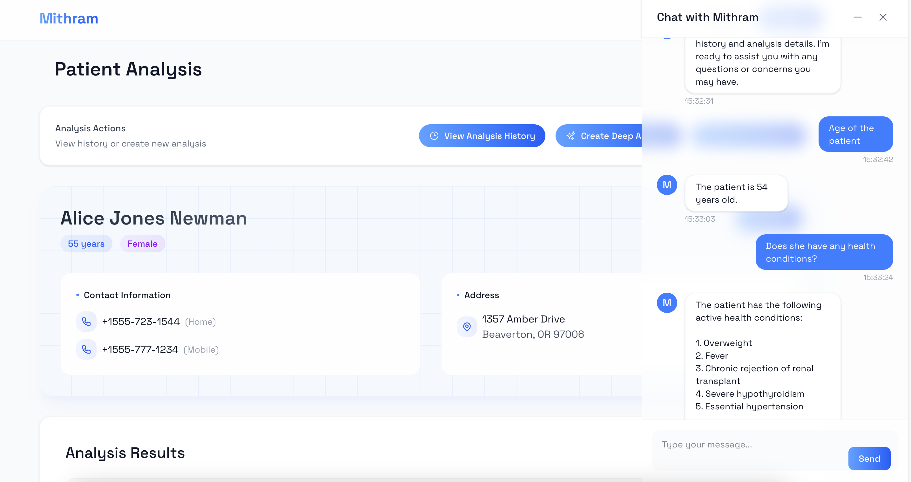
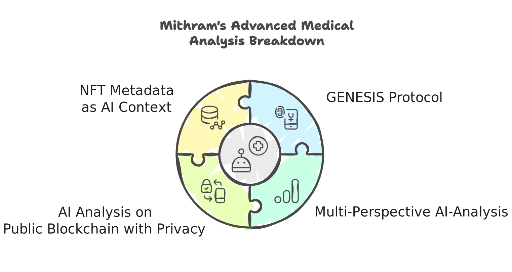

# Mithram - AI-Powered Medical Analysis System



Mithram(മിത്രം means Friend in Malayalam) is an advanced medical analysis Clinical Decision Support (CDS) Hooks service that leverages artificial intelligence to provide comprehensive, multi-perspective analysis of patient medical data. The service implements the novel GENESIS (Generative Enrichment via NFT and Synthesis) protocol for enhanced medical insights.




GENESIS (Generative Enrichment via NFT and Synthesis) is an innovative protocol that combines advanced AI techniques with blockchain technology to provide comprehensive medical analysis. It utilizes multi-perspective AI analysis, dynamic prompt generation, and NFT-based metadata integration to create a robust, secure, and enriched patient data analysis system.

## Features

- **GENESIS Protocol Implementation**
  - Multi-perspective AI analysis
  - Dynamic prompt generation
  - Parallel analysis processing
  - Result synthesis and enrichment
  - NFT-based metadata integration

- **Intelligent Chat System**
  - Context-aware medical responses
  - Fast-track processing for basic queries
  - Specialist consultation for complex cases
  - Message history with timestamps
  - Offline chat history stored in IndexedDB within users' browsers

- **Clinical Decision Support (CDS) Hooks**
  - SMART on FHIR authentication
  - Token-based session management
  - Secure API endpoints
  - Protected patient data handling

- **Modern UI/UX**
  - Responsive design
  - Intuitive navigation
  - Real-time loading states
  - Heroicons integration
  - Tailwind CSS styling

## Technical Stack

### Backend
- TypeScript
- Express.js
- LangChain
- FHIR Kit Client

### Frontend
- React
- Wouter (Routing)
- Tailwind CSS
- Heroicons
- Dexie

## Installation

1. Clone the repository:
```bash
git clone https://github.com/ronnakamoto/mithram.git
cd mithram
```

2. Install dependencies:
```bash
# Install backend dependencies
npm install

# Install frontend dependencies
cd frontend/smart-app
npm install
```

3. Configure environment variables:
```bash
cp .env.example .env
# Edit .env with your configuration
```

## Running the Application

1. Start the backend server:
```bash
npm run dev
```

2. Start the frontend application:
```bash
cd frontend/smart-app
npm start
```

## API Endpoints

### Analysis Endpoints
- `POST /analysis/:analysisId/deep-analysis`: Generate deep analysis using GENESIS protocol
- `GET /analysis/:analysisId`: Retrieve analysis details
- `GET /analysis/:analysisId/history`: Get analysis history

### Chat Service Endpoints
- `POST /chat/:patientId/init`: Initialize chat session with patient context
- `POST /chat/:patientId/message`: Process chat messages and generate responses
- `GET /chat/:patientId/history`: Retrieve chat history

### CDS Hooks Service
- `POST /cds-services`: Main CDS Hooks discovery point
- `POST /cds-services/:id`: Primary CDS hook endpoint

## Compliance and Data Governance

### B11 EHR Compliance
Our system implements key aspects of B11 criterion requirements for Electronic Health Records (EHR) systems:

#### Source Attributes
The system tracks the following data attributes:
- **Data Origin**: Source system identification via FHIR endpoints
- **Timestamp**: Creation and modification timestamps for analyses
- **Author**: Healthcare provider identification through SMART on FHIR authentication
- **Version**: Basic version tracking for analyses via NFT metadata
- **Access History**: Authentication-based access logging

#### FAVES Principles Implementation
Our system incorporates FAVES principles for responsible healthcare AI:

1. **Fairness**
   - Authentication-based access control
   - Standardized FHIR-based data processing

2. **Appropriateness**
   - Context-aware medical analysis
   - Integration with clinical workflows via CDS Hooks

3. **Validity**
   - SMART on FHIR compliance
   - Structured data validation

4. **Effectiveness**
   - Real-time analysis capabilities
   - Integrated chat interface for immediate feedback

5. **Safety**
   - Secure authentication via SMART on FHIR
   - Protected health information handling

### Data Security

- **Authentication**: SMART on FHIR-based authentication
- **Access Control**: Token-based authorization
- **Data Protection**: Secure API endpoints
- **Local Storage**: Client-side local storage(IndexedDB) for chat history
- **Session Management**: Secure session handling

## Security

- SMART on FHIR authentication
- Token-based session management
- Secure API endpoints
- Protected patient data handling
- Offline chat history

## Research Foundation

The GENESIS protocol implementation is based on the GENREAD idea discussed in the research paper (https://arxiv.org/abs/2209.10063) and extends traditional medical analysis techniques with advanced AI capabilities along with blockchain technologies.

## License

This project is licensed under the MIT License
